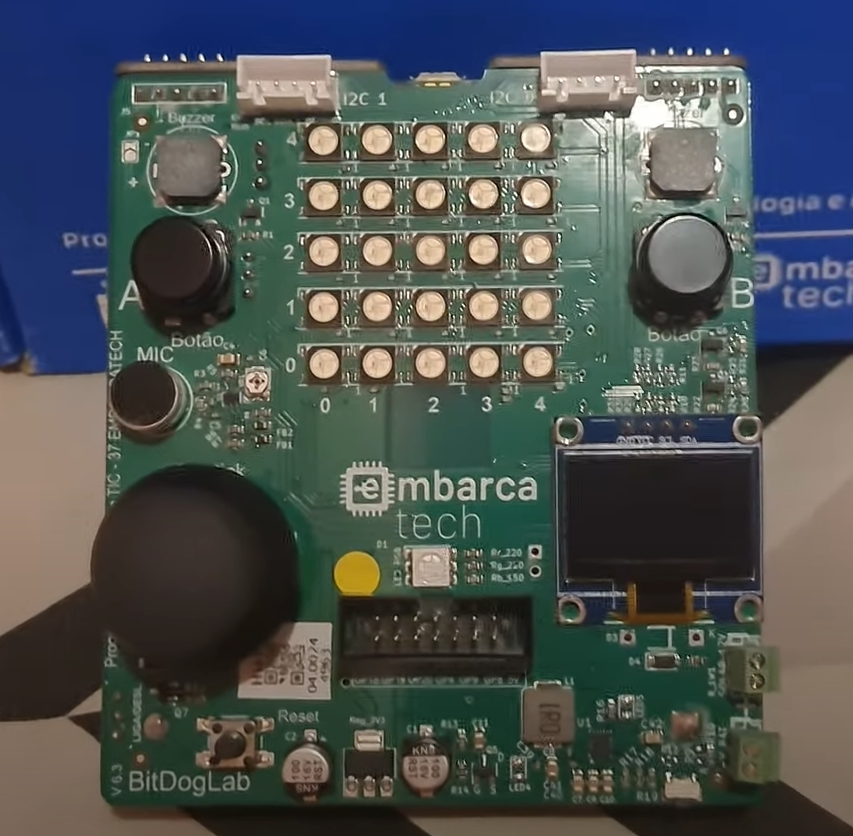

# Roger Melo - HBr – Campinas

Bem-vindo ao meu repositório!

## Objetivo

Este repositório contém projetos desenvolvidos durante o curso **EmbarcaTech 2025**. 

## Projetos

- [Projeto 1 - smart_strip](projetos/smart_strip)

## Meu Setup

## Diário de Bordo

### Semana 1
- Introdução ao curso e configuração do ambiente de desenvolvimento.

### Semana 2
- Primeiros projetos com hardware e software embarcado.

### Semana 3
- Desenvolvimento de aplicações com integração de sensores e atuadores.

*(Diário de Bordo atualizado semanalmente.)*

