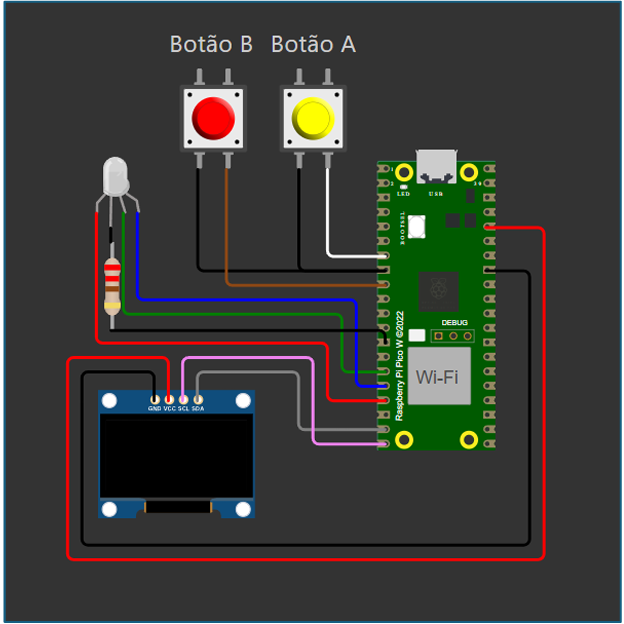
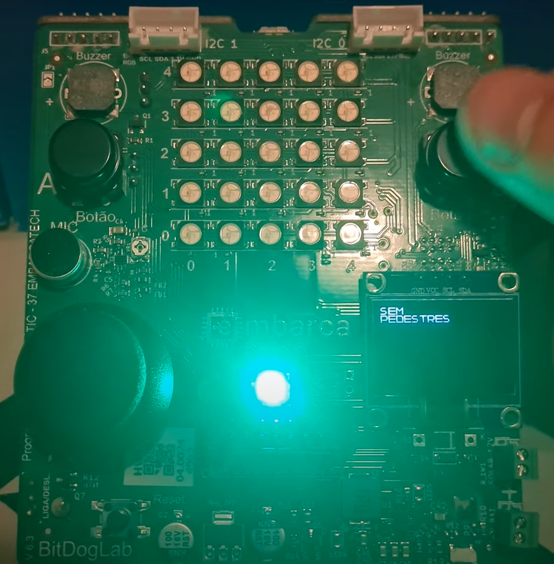

# README - Sistema de Controle de Passagem de Pedestres e Empilhadeiras

## 🎯 Objetivo do Projeto
O projeto visa criar um sistema simples de controle de passagem para pedestres e empilhadeiras em ambientes industriais. Utilizando tecnologias de automação e visão computacional, o sistema implementa a detecção de pedestres e veículos, acionando alertas visuais e sonoros para garantir a segurança no ambiente de trabalho. O sistema é voltado para reduzir erros humanos e melhorar a eficiência no controle de passagem.

## 🧩 Componentes Usados
- **Microcontrolador**: Raspberry Pi Pico (ou Pico W)
- **Display OLED**: 128x64 I2C
- **LEDs**: Vermelho, Verde, Azul
- **Botões de Pulso**: Para solicitar passagem
- **Fonte de Alimentação**: 5V via USB ou 3.3V interna

## ⚡ Pinagem dos Dispositivos
- **GPIO (Botões)**: 
  - Botão A: GPIO 5
  - Botão B: GPIO 6
  - Configurados como entrada com pull-up.
- **GPIO (LEDs)**:
  - LED Vermelho: GPIO 11
  - LED Verde: GPIO 12
  - LED Azul: GPIO 13
  - Configurados como saída.
- **I2C (Display OLED)**:
  - SDA: GPIO 14
  - SCL: GPIO 15
  - Velocidade de comunicação: 400 kHz.

## 🧪 Como Compilar e Executar
1. **Instalar dependências**:
   - Certifique-se de ter o ambiente de desenvolvimento adequado para o Raspberry Pi Pico.
   - Instale as bibliotecas necessárias para a comunicação I2C e controle dos GPIOs.

2. **Compilar o código**:
   - Compile o código-fonte utilizando a ferramenta o vscode

3. **Carregar para o dispositivo**:
   - Conecte o Raspberry Pi Pico ao seu computador via USB e carregue o código compilado para o dispositivo.

4. **Execução**:
   - Após o código ser carregado no Raspberry Pi Pico, o sistema começará a funcionar automaticamente. 
   - Pressione os botões para solicitar a passagem de pedestres ou empilhadeiras, e observe os LEDs e a tela OLED exibindo o estado atual.

## 🖼️ Imagens e Vídeos

[Assista ao vídeo explicativo do projeto](https://www.youtube.com/watch?v=0WUDzSgn6jc&ab_channel=RogerMelo)

## 📈 Resultados Esperados ou Observados
O sistema deve funcionar da seguinte forma:
- **Botão A**: Ao ser pressionado, ele solicita a passagem para pedestres. O sistema irá verificar a presença de pedestres e exibir uma contagem regressiva para a liberação ou bloqueio da passagem.
- **Botão B**: Ao ser pressionado, o sistema solicita a passagem para empilhadeiras. Ele bloqueia a passagem de pedestres e exibe a mensagem “Aguarde a Empilhadeira”.
- **LED Vermelho**: Indica que a passagem não está permitida para empilhadeiras.
- **LED Verde**: Indica que a passagem está liberada para pedestres ou empilhadeiras.
- **LED Azul**: Indica que a empilhadeira está em operação, bloqueando a passagem.
- **Display OLED**: Exibe mensagens de alerta e contagens regressivas, indicando o status atual do sistema.

## 📝 Especificações Técnicas
- **Alimentação**: 5V via USB ou 3.3V interna.
- **Microcontrolador**: RP2040, dual-core ARM Cortex-M0+ a 133 MHz, 264 KB de RAM.
- **Display**: OLED 128x64 I2C, endereço 0x3C.
- **Botões**: Pull-up interno, leitura em GPIO.
- **LEDs**: Funcionando em 3,3V.

## 🧰 Lista de Materiais
1. **Raspberry Pi Pico (ou Pico W)**.
2. **Display OLED 128×64 I2C**.
3. **3 LEDs** (Vermelho, Verde, Azul).
4. **2 Botões de Pulso**.
5. **Cabo USB** para alimentação e programação.
